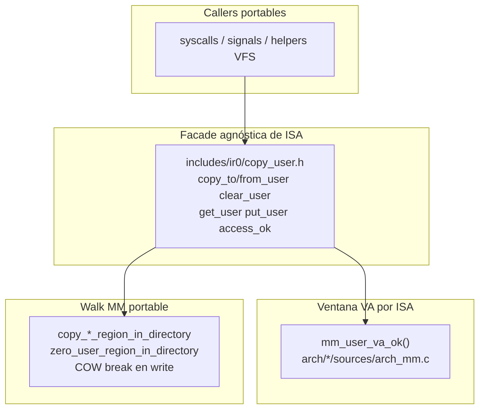

# Frontera kernel ↔ userspace (uaccess)

> **Última verificación:** 2026-09-02  
> **Fuente de verdad:** `includes/ir0/copy_user.h`, `kernel/lib/copy_user.c`,  
> `includes/ir0/mm.h` (`mm_user_va_ok`), `arch/*/sources/arch_mm.c`,  
> `mm/paging.c` (`copy_*_region_in_directory`, `zero_user_region_in_directory`),  
> `kernel/lib/signals.c`, `scripts/architecture_guard.py`  
> (`check_usercopy_no_raw_user_touch`), `tests/host/test_usercopy_contract.c`,  
> `scripts/smoke_session_soak.py` (FATAL incluye `KERNEL_UACCESS_FAULT`)

Contrato **canónico** de toda lectura/escritura del kernel a una VA userspace.
Sirve para **clasificar fallos por capa e ISA**, sin mezclar “SEGV de sesión”,
“#DF” y “memcpy bajo CR3” en un solo síntoma.

Canónico en inglés: [`../uaccess.md`](../uaccess.md).

## Por qué importa esta frontera

`CONSOLE_SESSION_SEGV` en serial **no** es causa raíz. Tras la oleada uaccess,
el árbol separa tres clases:

| Clase | Tag serial típico | Dónde mirar | No confundir con |
|-------|-------------------|-------------|------------------|
| Kernel tocó VA user sin copia COW-safe | `CLASSIFY KERNEL_UACCESS_FAULT` (+ `USER_FAULT_FRAME`, `cs=8`) | Caller que saltó `copy_*_user` | Bug de userspace |
| #PF / SIGSEGV genuino de userspace | `USER_FAULT_FRAME` con `cs=user`, o SEGV de sesión sin classify uaccess | Proceso / libc / ash | Bug de memcpy kernel |
| #PF anidado / switch / kstack → #DF | `CLASSIFY PRIMARY_VECTOR_*`, tags nested | `sched/switch`, orden CR3 | uaccess |

**Objetivo de reproducibilidad:** si aparece `KERNEL_UACCESS_FAULT`, el bug
está en el **contrato portable o en un caller que lo bypasseó** — no en ash,
ni (por defecto) en el entry ASM de la ISA. Si no aparece y el shell muere,
buscar en otro sitio (TTY, pipe, delivery de señales *después* de un copy OK).



## Contrato (reglas duras)

1. **Nunca** `memcpy` / `memset` / `strncpy` / `*` directo a un puntero
   userspace en un path de producción.
2. **Siempre** usar:
   - `copy_to_user` / `copy_from_user` / `clear_user` para el mm **actual**, o
   - `copy_to_user_region_in_directory` / `copy_from_user_region_in_directory` /
     `zero_user_region_in_directory` cuando el pgd es explícito (señales, otro
     proceso, CR3 distinto).
3. **Nunca** `load_page_directory(user_pgd)` + `memcpy((void *)user_va, …)`.
   Ese patrón mató ash post-login: write a PTE presente RO / COW con `cs=8` →
   `KERNEL_UACCESS_FAULT`.
4. Preferir bounce para structs chicos (`utsname`, `timeval`, `timespec`):
   rellenar en stack kernel y un `copy_to_user`.
5. El bypass `KERNEL_MODE` en `copy_user.c` es **solo** dbgshell / tareas
   embebidas — no para punteros ring-3.

Comentario de contrato: [`includes/ir0/copy_user.h`](../../includes/ir0/copy_user.h).

## Mapa de API (portable)

| API | Rol |
|-----|-----|
| `access_ok(addr, n)` | Alias de `is_user_address` (nombre estilo Linux) |
| `is_user_address` / `_checked` | Ventana VA (+ walk mapped opcional) |
| `copy_to_user` / `copy_from_user` | Proceso actual → region helpers |
| `clear_user` | Cero vía `zero_user_region_in_directory` |
| `get_user` / `put_user` | Macros escalares sobre `copy_*_user` |
| `copy_*_region_in_directory` | pgd explícito (declarado en `copy_user.h`) |

Implementación con COW: [`mm/paging.c`](../../mm/paging.c). Es la **única**
vía soportada para romper COW en un write iniciado por el kernel.

## Layout multi-ISA (aislar fallos por arquitectura)

| Capa | Ruta en el árbol | Responsabilidad |
|------|------------------|-----------------|
| Contrato + macros | `includes/ir0/copy_user.h` | Misma API en toda ISA |
| Glue portable | `kernel/lib/copy_user.c` | Modo, `mm_user_va_ok`, dispatch a region |
| Ventana VA | `mm_user_va_ok` en `arch/*/sources/arch_mm.c` | Rango user canónico por ISA |
| COW / walk PTE | `mm/paging.c` (MM producción x86-64) | Presente RO / COW break |
| Arm64 early | MM early / helpers existentes | Debe pasar por nombres `copy_*_user`; **sin reclamar COW** hasta paridad |

**Cómo aislar un bug de ISA:**

1. `mm_user_va_ok` rechaza un rango user válido → política VA en **arch**.
2. Rango OK pero region/`-EFAULT` / COW mal → **`mm/`**.
3. Ninguno: el caller bypasseó el facade → **caller portable**.
4. Arm64 early sin COW: no inventar una segunda API con otro nombre.

Ventana x86-64: `0x00400000` … `0x00007FFFFFFFFFFF` en
[`arch/x86-64/sources/arch_mm.c`](../../arch/x86-64/sources/arch_mm.c).

## Callers migrados (P0, 2026-09-02)

| Área | Archivo | Patrón actual |
|------|---------|---------------|
| Frames / `siginfo` | `kernel/lib/signals.c` | `copy_to_user_region_in_directory(process_pgd(p), …)` |
| `uname` | `kernel/syscalls/fs_path_syscalls.c` | `utsname` kernel + `copy_to_user` |
| `gettimeofday` | `kernel/syscalls/time_syscalls.c` | bounce + `copy_to_user` |
| `nanosleep` rem | `kernel/syscalls/io_syscalls.c` | `copy_from_user` / `copy_to_user` |
| `getrandom` | `kernel/syscalls/process_syscalls.c` | chunk kernel + `copy_to_user` |
| mprotect zero | `kernel/syscalls/mm_syscalls.c` | `zero_user_region_in_directory` |

## Enforcement estático (forma del árbol → CI reproducible)

`check_usercopy_no_raw_user_touch()` en `architecture_guard.py`:

| Tag | Prohíbe |
|-----|---------|
| `[usercopy-no-cr3-memcpy]` | `load_page_directory` + `memcpy((void *)` / `memset((void *)` en la misma función |
| `[usercopy-signals]` | cualquier `memcpy((void *)` en `signals.c` |
| `[usercopy-sys-uname]` | `memset(buf` / `strncpy(buf->` en `sys_uname` |

Host: `tests/host/test_usercopy_contract.c`. Ver también
[`DECOUPLING.md`](DECOUPLING.md) (mapa de guards).

## Diagnóstico en runtime (serial)

| Tag | Significado |
|-----|-------------|
| `USER_FAULT_FRAME` | Dump antes de kill/handler |
| `CLASSIFY KERNEL_UACCESS_FAULT` | #PF en kernel (`cs=8`) sobre VA user |
| `CONSOLE_SESSION_SEGV` | Murió el shell (solo síntoma) |

El soak marca `KERNEL_UACCESS_FAULT` como **FATAL**.

### Checklist de bisect

1. Rebuild ISO userspace + md5 bin ↔ ISO (ISO stale culpa símbolos falsos).
2. Login+prompt: conteo `KERNEL_UACCESS_FAULT` = **0**.
3. `addr2line` del `rip` en `USER_FAULT_FRAME`: si cae en `memcpy`/`string.c`,
   buscar callers con store crudo a user.
4. Si `cs` es ring user: no es bug uaccess del kernel.

## Gates (verificados 2026-09-02)

```bash
make -s kernel-x64.bin
make -s arch-guard
make -s -C tests/host run
rm -f kernel-x64-userspace.iso
make -s kernel-x64-userspace.iso
SOAK_ROUNDS=2 make -s smoke-session-soak
```

## Documentos relacionados

- [`MEMORY.md`](MEMORY.md) — COW / page-fault  
- [`PROCESSES.md`](PROCESSES.md) — señales  
- [`DECOUPLING.md`](DECOUPLING.md) — facades + arch-guard  
- [`../devfs-io-contract.md`](../devfs-io-contract.md) — usercopy en devices  
- [`../mandocs/esp/syscalls.md`](../mandocs/esp/syscalls.md) — overview syscalls  

## Límites conocidos / fuera de oleada

- `get_user`/`put_user` asm óptimo (hoy macros sobre `copy_*`).
- Paridad completa MM+COW en arm64.
- Ban exhaustivo de todo `memset` en `kernel/` — la guardia es heurística P0;
  extender cuando aparezca otra clase de caller.
