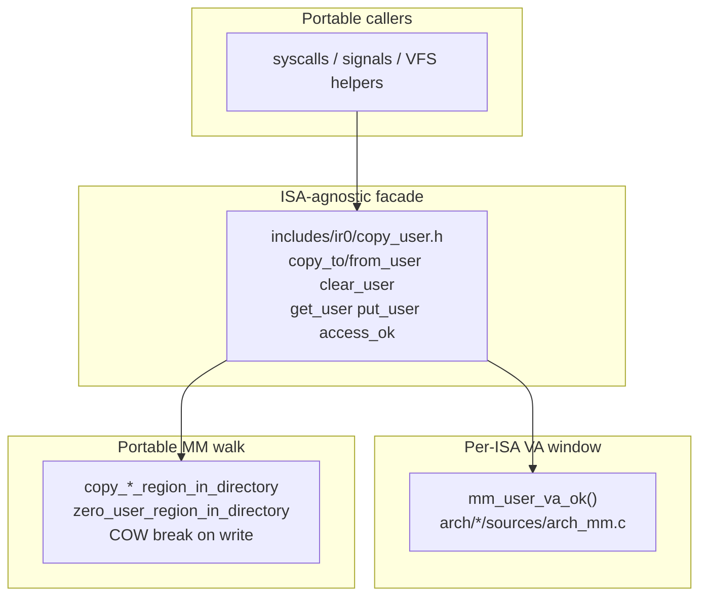

# Kernel ↔ userspace copy frontier (uaccess)

> **Last verified:** 2026-09-02  
> **Source of truth:** `includes/ir0/copy_user.h`, `kernel/lib/copy_user.c`,  
> `includes/ir0/mm.h` (`mm_user_va_ok`), `arch/*/sources/arch_mm.c`,  
> `mm/paging.c` (`copy_*_region_in_directory`, `zero_user_region_in_directory`),  
> `kernel/lib/signals.c`, `scripts/architecture_guard.py`  
> (`check_usercopy_no_raw_user_touch`), `tests/host/test_usercopy_contract.c`,  
> `scripts/smoke_session_soak.py` (FATAL includes `KERNEL_UACCESS_FAULT`)

This document is the **canonical contract** for every kernel write/read of a
userspace virtual address. It exists so faults can be **classified by layer
and ISA** instead of mixing “session SEGV”, “#DF”, and “memcpy under CR3”
into one symptom.

Spanish mirror: [`esp/uaccess.md`](esp/uaccess.md).

## Why this boundary matters

A single serial line `CONSOLE_SESSION_SEGV` is **not** a root cause. After the
uaccess oleada, the tree separates three distinct failure classes:

| Class | Typical serial tag | Where to look | Not the same as |
|-------|--------------------|---------------|-----------------|
| Kernel touched user VA without COW-safe copy | `CLASSIFY KERNEL_UACCESS_FAULT` (+ `USER_FAULT_FRAME`, `cs=8`) | Caller skipped `copy_*_user` | Userspace bug |
| Genuine userspace #PF / SIGSEGV | `USER_FAULT_FRAME` with `cs=user`, or session SEGV without uaccess classify | Process / libc / ash | Kernel memcpy bug |
| Nested / switch / kstack #PF → #DF | `CLASSIFY PRIMARY_VECTOR_*`, nested halt tags | `sched/switch`, CR3 order | uaccess |

**Reproducibility goal:** if `KERNEL_UACCESS_FAULT` appears, the bug is in
the **portable copy contract or a caller that bypassed it** — not in ash, and
not (by default) in arch entry ASM. If it never appears but the shell dies,
look elsewhere (TTY, pipe, signal delivery logic *after* a successful frame
copy, etc.).



## Contract (hard rules)

1. **Never** `memcpy` / `memset` / `strncpy` / direct `*` stores into a
   userspace pointer from kernel code on a production userspace path.
2. **Always** use:
   - `copy_to_user` / `copy_from_user` / `clear_user` for the **current** mm, or
   - `copy_to_user_region_in_directory` / `copy_from_user_region_in_directory` /
     `zero_user_region_in_directory` when the target pgd is known (signals,
     other process, CR3 may differ).
3. **Never** `load_page_directory(user_pgd)` + raw `memcpy((void *)user_va, …)`.
   That pattern caused the post-login ash kill: write to a present RO / COW PTE
   under kernel `cs=8` → `KERNEL_UACCESS_FAULT`.
4. Bounce buffers are preferred for small structs (`utsname`, `timeval`,
   `timespec`): fill on the kernel stack, then one `copy_to_user`.
5. `KERNEL_MODE` bypass inside `copy_user.c` is **only** for dbgshell / embedded
   kernel tasks — not for ring-3 pointers.

Header contract comment: [`includes/ir0/copy_user.h`](../includes/ir0/copy_user.h).

## API map (portable)

| API | Role |
|-----|------|
| `access_ok(addr, n)` | Alias of `is_user_address` (Linux-shaped name) |
| `is_user_address` / `_checked` | VA window (+ optional mapped walk) |
| `copy_to_user` / `copy_from_user` | Current process; routes to region helpers |
| `clear_user` | Zero user range via `zero_user_region_in_directory` |
| `get_user` / `put_user` | Scalar macros over `copy_*_user` |
| `copy_*_region_in_directory` | Explicit pgd (declared in `copy_user.h` so syscalls need not include `mm/paging.h` for the contract alone) |

Region implementations live in [`mm/paging.c`](../mm/paging.c) and perform
COW-aware page walks. That is the **only** supported way to break COW on a
kernel-initiated user write.

## Multi-ISA layout (fault isolation by architecture)

| Layer | Tree path | Responsibility |
|-------|-----------|----------------|
| Contract + macros | `includes/ir0/copy_user.h` | Same API on every ISA |
| Portable glue | `kernel/lib/copy_user.c` | Mode check, call `mm_user_va_ok`, dispatch to region helpers |
| VA window | `mm_user_va_ok` in `arch/x86-64/sources/arch_mm.c` and `arch/arm64/sources/arch_mm.c` | ISA canonical user range |
| COW / PTE walk | `mm/paging.c` (x86-64 production MM) | Present RO / COW break |
| Arm64 early | early MM / `arm64_mmu_user_buf_ok` where still used | Must still go through `copy_*_user` names; **no COW claim** until portable MM matches |

**How to isolate an ISA bug:**

1. If `mm_user_va_ok` rejects a valid userspace range → fix **arch** VA policy.
2. If range OK but region walk returns `-EFAULT` / COW mishandled → fix **`mm/`**.
3. If neither: caller bypassed the facade → fix **portable caller** (`kernel/lib`, `kernel/syscalls`).
4. Arm64 early without COW: expect `-EFAULT` or incomplete write semantics until MM parity; do **not** invent a second parallel API name.

x86-64 window (code): `0x00400000` … `0x00007FFFFFFFFFFF` in
[`arch/x86-64/sources/arch_mm.c`](../arch/x86-64/sources/arch_mm.c).

## Callers migrated (P0, 2026-09-02)

| Area | File | Pattern now |
|------|------|-------------|
| Signal frames / `siginfo` | `kernel/lib/signals.c` | `copy_to_user_region_in_directory(process_pgd(p), …)` |
| `uname` | `kernel/syscalls/fs_path_syscalls.c` | kernel `struct utsname` + `copy_to_user` |
| `gettimeofday` | `kernel/syscalls/time_syscalls.c` | bounce + `copy_to_user` |
| `nanosleep` rem | `kernel/syscalls/io_syscalls.c` | `copy_from_user` / `copy_to_user` |
| `getrandom` | `kernel/syscalls/process_syscalls.c` | kernel chunk + `copy_to_user` |
| mprotect zero | `kernel/syscalls/mm_syscalls.c` | `zero_user_region_in_directory` |

Paths that already bounced (`sys_read` / `sys_write`, getdents kbuf) were left
alone.

## Static enforcement (tree structure → reproducible CI)

`scripts/architecture_guard.py` → `check_usercopy_no_raw_user_touch()`:

| Guard tag | What it bans |
|-----------|--------------|
| `[usercopy-no-cr3-memcpy]` | `load_page_directory` then `memcpy((void *)` / `memset((void *)` in same function under `kernel/syscalls/**` or signals |
| `[usercopy-signals]` | any `memcpy((void *)` in `kernel/lib/signals.c` |
| `[usercopy-sys-uname]` | `memset(buf` / `strncpy(buf->` inside `sys_uname` |

Host contract: `tests/host/test_usercopy_contract.c` (`usercopy_no_raw_user_touch`)
asserts the same signals / `sys_uname` properties without QEMU.

Together with existing `check_devfs_usercopy_contract`, usercopy rules live next
to other **tree-shape** guards in [`DECOUPLING.md`](DECOUPLING.md) — failures
point at a **path + line**, not a vague “session died”.

## Runtime diagnosis (serial)

| Tag | Meaning |
|-----|---------|
| `USER_FAULT_FRAME` | Frame dump before kill/handler (`cr2`, `rip`, `cs`, `err`, pid) |
| `CLASSIFY KERNEL_UACCESS_FAULT` | #PF in kernel (`cs=8`) on a user VA — **contract violation or missing mapping** |
| `CONSOLE_SESSION_SEGV` | Shell/session died (symptom only) |

Soak harness [`scripts/smoke_session_soak.py`](../scripts/smoke_session_soak.py)
treats `KERNEL_UACCESS_FAULT` as **FATAL** (same class as panic / canary).

### Bisect checklist

1. Rebuild userspace ISO after kernel change; verify bin ↔ ISO digest match
   (stale ISO falsely blames unrelated symbols).
2. Grep serial: `KERNEL_UACCESS_FAULT` count must be **0** at login+prompt for
   a healthy session.
3. `addr2line` on `rip` from `USER_FAULT_FRAME`: if it lands in `memcpy` /
   `string.c`, search callers for raw user stores (should be impossible under
   arch-guard for signals/syscalls P0).
4. If `cs` is user ring: not a uaccess kernel bug — treat as userspace / signal
   delivery after a successful copy.

## Gates (verified 2026-09-02)

```bash
make -s kernel-x64.bin
make -s arch-guard
make -s -C tests/host run          # includes usercopy_no_raw_user_touch
rm -f kernel-x64-userspace.iso
make -s kernel-x64-userspace.iso   # then md5 bin ↔ extracted ISO kernel
SOAK_ROUNDS=2 make -s smoke-session-soak
# expect: 0× KERNEL_UACCESS_FAULT, session_segv=0
```

## Related documents

- [`MEMORY.md`](MEMORY.md) — COW / page-fault policy  
- [`PROCESSES.md`](PROCESSES.md) — signals / wait  
- [`DECOUPLING.md`](DECOUPLING.md) — façade + arch-guard map  
- [`devfs-io-contract.md`](devfs-io-contract.md) — device read/write usercopy  
- [`mandocs/en/syscalls.md`](mandocs/en/syscalls.md) — syscall entry overview  
- [`mandocs/en/mm.md`](mandocs/en/mm.md) — MM internals  

## Known limits / not in this oleada

- Optimal asm `get_user` / `put_user` (macros over `copy_*` only).
- Full arm64 production MM + COW parity.
- Exhaustive ban of every possible `memset` into a misnamed local in all of
  `kernel/` — guard is heuristic on the known P0 antipatterns; extend when a
  new caller class appears.
