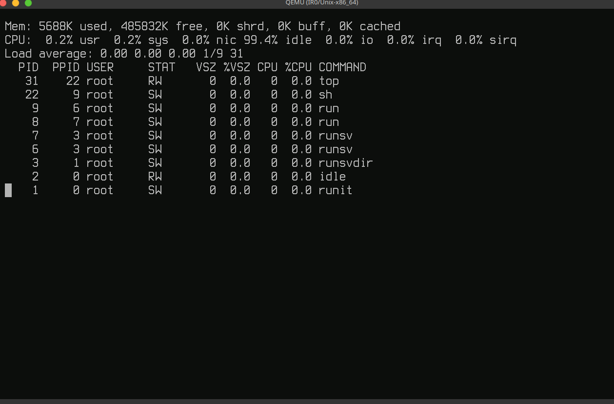
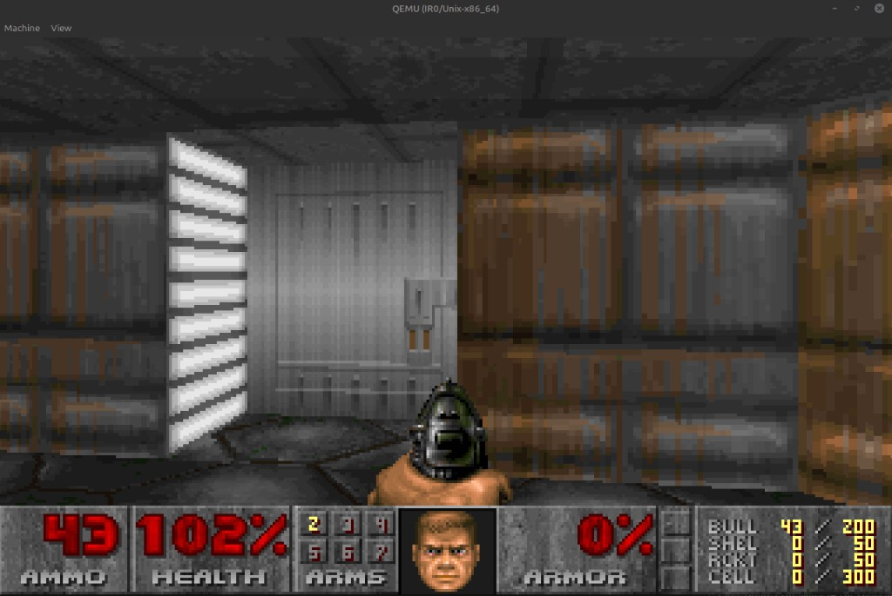
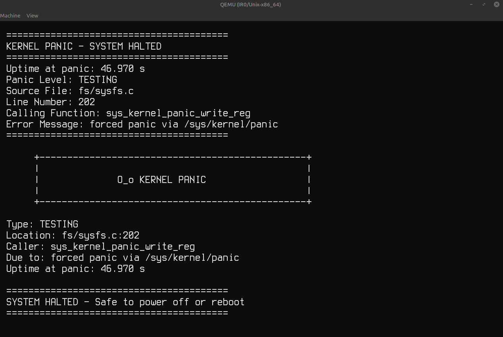

<p align="center">
  
</p>

<h1 align="center">IR0 Kernel</h1>

<p align="center">
 Unix-like kernel (GPL-3.0) — x86-64 bring-up under QEMU, narrow facades,
 partial Linux ABI.
</p>

  IR0 is a operating-system kernel (GPL-3.0). Primary bring-up target is
  **x86-64** under QEMU (Multiboot, GRUB, VFS/MINIX, ELF userspace). Version
  string: **`0.0.1-rc4`** (last pre-release before `v0.0.1` final).


## ISD — IR0 Software Distribution

**ISD** is the official product userspace for IR0: runit PID 1, BusyBox,
login/firstboot, packages, rootfs, and the MINIX `disk.img`. Sources live in
the sibling repo [`ISD`](https://github.com/IRodriguez13/ISD). This tree is the
kernel, UAPI export, and QEMU/boot orchestration.

| Layer | Role |
|-------|------|
| **IR0** (this tree) | mechanisms, drivers, UAPI, ISO |
| **ISD** (sibling repo) | packages, services, rootfs, `disk.img` |
| **Product** (both) | `make first-boot` / `make run PROFILE=…` |

IR0 does **not** inject BusyBox/runit/nano individually on the canonical path —
ISD builds a finished image; IR0 boots it.

### Screenshots (ISD on QEMU)

<p align="center">
  
</p>

<p align="center"><em>First boot: runit stage1 → account wizard (password also used for doas).</em></p>

<p align="center">
  
</p>

<p align="center"><em>Logged-in shell: Unix hierarchy, <code>uname -a</code>, privilege elevation with <code>doas</code>.</em></p>

<p align="center">
  
</p>

<p align="center"><em>BusyBox <code>vi</code> on the ISD rootfs (QEMU GTK).</em></p>

<p align="center">
  
</p>

<p align="center"><em>BusyBox <code>top</code>: runit PID 1, <code>runsvdir</code>/<code>runsv</code>, ash, and idle.</em></p>

<p align="center">
  
</p>

<p align="center"><em>Doom on IR0/Unix (<code>PROFILE=desktop</code>): framebuffer + input path.</em></p>

<p align="center">
  
</p>

<p align="center"><em>Kernel panic on the GTK framebuffer (trigger: write to <code>/sys/kernel/panic</code>). Uptime, panic level, and <code>Safe to power off or reboot</code>.</em></p>

## Getting started

```bash
git clone https://github.com/IRodriguez13/IR0.git
cd IR0
make check-env                    # host diagnostic (or: first-boot asks to install)
make first-boot PROFILE=minimal   # host deps (ask) + clone ../ISD + image + ISO
make run PROFILE=minimal          # QEMU GTK → getty → BusyBox ash
```

`first-boot` asks before installing host packages (`IR0_DEPS_INSTALL=ask|yes|never`).
sudo is used only for that install, never for clone/build. It does not require Rust
nightly (only if you enable example drivers in menuconfig). Host needs musl-tools,
bison (`yacc`), git, curl, and the usual desktop ISO toolchain — see [SETUP.md](SETUP.md).

Layout:

```text
parent/
├── IR0/
└── ISD/                  # cloned automatically if missing
```

Kernel-only ISO (no shell): `make ir0`. Without `/sbin/init` on the ISD disk the
kernel **panics** at handoff — there is no in-kernel fallback shell.

```bash
make sync-mandocs         # man pages → ~/.local/share/man (no sudo)
make man TOPIC=onboarding
make man TOPIC=boot
```

Full coupling guide: **[Documentation/USERSPACE.md](Documentation/USERSPACE.md)**.

| Profile | Meaning | Status |
|---------|---------|--------|
| `desktop` / `make desktop-x86_64` | x86-64 ISO + QEMU | **Supported** — official first boot |
| `userspace` | musl / BusyBox ISO path | **Experimental** |
| `hub-rpi4` | ARM64 RPi4 UART min | **Hardware lab / UART** — boots under QEMU `raspi4b` when present; **not** SD-flashable |
| `watch-rpi5-stub` | ARM64 RPi5 stub | **Planned** — compile-only (`uart=none`) |

```bash
make check-env PROFILE=desktop-x86_64
make run-bootlog                   # optional: boot log → build/hostshare/ir0-boot.log
make help-profiles
make pre-submit                    # local contributor gate → PRE_SUBMIT_OK
```

Full toolchain notes: **[SETUP.md](SETUP.md)**.
How to contribute: **[CONTRIBUTING.md](CONTRIBUTING.md)**.
Subsystem docs: **[Documentation/](Documentation/README.md)** — `make man TOPIC=…`.

## Context

**Linux ABI:** partial by design — syscall coverage grows contract-by-contract
(`Documentation/releases/IR0_0.0.1_ABI_BOARD.md`, `make linux-abi-audit`).

**x86-64 (default):** uniprocessor kernel with RR scheduling, fork/exec/wait,
demand paging and fork COW paths exercised in-tree, VFS (MINIX root, tmpfs,
path-routed `/proc`/`/sys`), console/TTY, musl/BusyBox bring-up. Networking
includes UDP/ICMP, **AF_UNIX** streams, and lab-grade TCP — not a full Internet
stack or production NIC story. Optional demos: BusyBox `ash` via runit
(`make load-userspace-runit` / `run-fase58e-ash-gui`), doomgeneric on `/dev/fb0`.

**ARM64:** early bring-up and board scaffolding (QEMU `virt`, RPi4 UART lab).
Not a flashable appliance and not feature-parity with x86.

**Non-goals today:** SMP, desktop-class userspace, or “better than Linux.”
Near-term focus is open, rebuildable appliance profiles with a thin Makefile
surface and actionable diagnostics.

**Failure model:** `BUG_ON` / `ASSERT` go straight to `panicex()` and halt
(no continue-in-prod path). Before the final banner you still get classified
output on serial: panic level, optional **FAULT FRAME** (CPU cause vs reporter),
`[KTM][PANIC_SITE]`, stack/registers, and nested-fault tagging
(`CLASSIFY NESTED_PANIC_OR_FAULT`). Userspace faults log `USER_FAULT_FRAME`
without kernel panic. See `includes/ir0/oops.h`, `kernel/lib/oops.c`.

## License

GNU General Public License v3.0 — see [LICENSE](LICENSE).
Third-party trees (BusyBox, doomgeneric, …) keep their own licenses under `setup/`.
